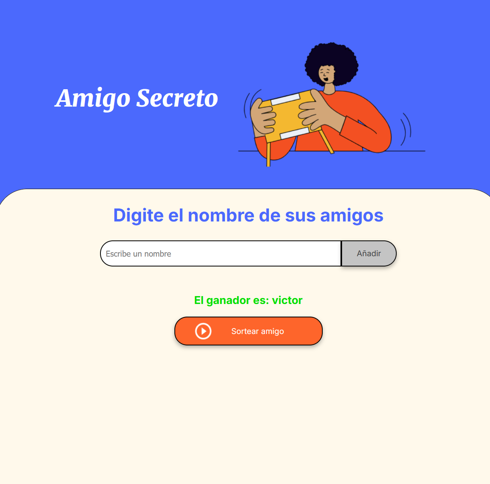

# Amigo Secreto

Es un proyecto integrador de introducción a la programación en JS 

## Descripción del proyecto
Consiste en escribir un nombre y que este sea mostrado dentro de la pantalla, de la pantalla al presionar el botón de añadir lo guarde en una lista y la muestre al usuario y a su vez al presionar el botón de sortear usuario devuelve un ganador


## Detalles
```html
...
<div class="input-wrapper">
    <input type="text" id="amigo" class="input-name" placeholder="Escribe un nombre">
    <button class="button-add" onclick="agregarAmigo()">Añadir</button>
</div>
...
```
En esta sección del código se llama una función la cual la cual guarda la información en un arreglo que esta contenida en dos funciones

```js
// función para agregar amigos a la lista e imprimirlos en etiquetas li
const agregarAmigo = () => {
    // limpia la lista de ganador en caso de que se vuelva a reutilizar
    containerUserWinner[0].innerHTML = "";
    let nameUser = friendUser[0].value;
    // evita que se envie información vacia
    if (nameUser==""){
        alert("Debes escribir un nombre");
        return;
    }
    // evita que se agregue la misma persona dos veces
    if(!friendList.includes(nameUser)){
    friendList.push(nameUser)
    }
    else{
        alert(`Ya has agregado a ${nameUser}`);
        return;
    }
    // imprime la lista de amigos en la etiqueta ul
    containerList[0].innerHTML = printFriend(friendList);
    // limpia el input del nombre del amigo
    friendUser[0].value = "";
}

function printFriend(list)
{
let elements = "";
for(let i=0; i<list.length; i++){
    elements += `<li>${list[i]}</li>`;  
}
return elements;
}
```

Posteriormente esta la función que sorteara aun usuario al azar
```js

const sortearAmigo = () => {
    // evita que se sortee si no hay amigos
    if(friendList.length===0){
        alert("No hay amigos para sortear");
        return;
    }
    let luckyNumber = Math.floor(Math.random()*friendList.length);
    containerUserWinner[0].innerHTML = `<li>El ganador es: ${friendList[luckyNumber]}</li>`
    // limpia la lista de amigos y el arreglo
    friendList= [];
    containerList[0].innerHTML = "";
}
```

## Algunas pruebas
- si de añade pero no se ha escrito nada

Envía un alert de que esta vacío

- si se añade un nombre

Se añade el nombre y se limpia el campo
- si se añade un nombre repetido

Nos devuelve una alert con el nombre que esta repetido
- si se sortea y esta vació

nos devolvera un alert que no hay amigos guardados
- si se sortea y hay elementos

Devuelve un ganador
